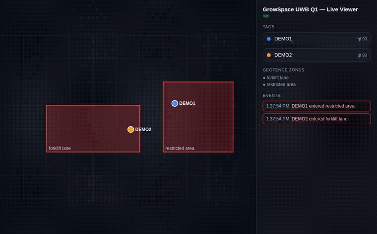

# GrowSpace UWB Q1 — 실내 위치측위(RTLS) 예제 코드

**GrowSpace UWB 크리에이터 키트 Q1**(UWB 실내 위치측위 개발키트, 정확도 10~30cm, 시리얼·MQTT 출력)용 오픈소스 Python·Arduino·Raspberry Pi 예제 코드입니다.

- 키트·가격: https://grow-space.io/uwb-kit/
- 공식 가이드: https://grow-space.io/docs/q1/
- English: [README.md](README.md)

## 무엇을 만들 수 있나요

- 시리얼로 실시간 UWB 좌표 읽기
- MQTT로 UWB 위치 데이터 구독
- 태그 위치를 실시간 2D 지도로 시각화
- 태그 2개로 로봇 방향각(heading) 계산
- 진입·이탈 알림이 있는 지오펜스 구역 구성
- Arduino, ESP32, Raspberry Pi에 UWB 위치 데이터 연동

하드웨어 없이 먼저 체험하려면 아래 [실시간 뷰어](#실시간-뷰어-웹-ui)를 확인하세요.

## 출력 형식

시리얼(115200bps)로 `lep`을 보내면 좌표가 텍스트로 나옵니다.

| 장치 | 형식 | 예시 |
|---|---|---|
| 개발자 태그 | `POS,x,y,z,qf` | `POS,-3.41,9.54,-1.53,74` |
| 리스너 | `POS,idx,태그ID,x,y,z,qf` | `POS,0,365D,-3.41,9.54,-1.53,74` |
| 게이트웨이(MQTT) | `uwb/gateway/...` 아래 `tags` 배열 JSON | `{"gatewayID":"GR21BA","tags":[{"id":"GR2c3c","x":-3.95,"y":0.23,"z":-2.48}]}` |

좌표 단위는 미터, `qf`는 0~100 품질지수(60 이상이면 대체로 안정)입니다.

## 예제

| 파일 | 내용 |
|---|---|
| `python/serial_reader.py` | 태그·리스너 좌표 실시간 출력(QF 필터) |
| `python/heading_two_tags.py` | 태그 2개(앞·뒤)로 로봇 방향각 계산 |
| `python/geofence.py` | 다각형 구역 진입·이탈 알림(경계 깜빡임 방지) |
| `python/mqtt_subscriber.py` | 게이트웨이 MQTT 좌표 구독 |
| `python/q1_parse.py` | 시리얼·게이트웨이 JSON 공용 파서 |
| `arduino/uno_altsoftserial` | 아두이노 우노(AltSoftSerial, D8/D9) |
| `arduino/mega_serial1` | 아두이노 메가(하드웨어 Serial1) |

```bash
cd python
pip install -r requirements.txt
python serial_reader.py --port /dev/ttyUSB0
python -m pytest        # 파서 테스트, 하드웨어 불필요
```

## 실시간 뷰어 (웹 UI)

`python/visualizer/`는 태그를 2D 도면 위에 실시간으로 보여주는 대시보드입니다. 태그마다 이름(라벨)을 붙일 수 있고, 지오펜스 구역에 태그가 들어오거나 나가면 빨강/초록으로 반짝입니다.



```bash
cd python/visualizer
pip install -r requirements.txt
python server.py --source demo                     # 하드웨어 없이 먼저 체험
python server.py --source serial --port /dev/ttyUSB0
python server.py --source mqtt --host 192.168.0.10
```

이후 http://localhost:8000 접속. 사이드바에서 태그 이름을 클릭해 원하는 이름으로 바꿀 수 있습니다(브라우저에 저장). 구역은 `zones.example.json`에서 정의하며, `--zones` 옵션으로 자신의 도면에 맞는 파일을 지정할 수 있습니다.

## 배선 주의

개발자 태그 커넥터는 **우측 5V(아두이노)**, **좌측 3.3V(라즈베리파이·ESP32)**입니다. 라즈베리파이에 5V 쪽을 연결하면 UART가 손상될 수 있습니다. TX↔RX는 교차 연결합니다.

## 가이드

- **[라즈베리파이 퀵스타트](docs/quickstart-raspberry-pi.ko.md)** — 배선, UART 설정, 10분 만에 위치 데이터 받기
- **[문제 해결 가이드](docs/troubleshooting.ko.md)** — 시리얼 데이터 없음, 텍스트 깨짐, 낮은 `qf`, 파이/ESP32/아두이노/MQTT 문제

## 관련 글

- UWB 개발키트 Q1으로 만드는 프로젝트 4가지: https://grow-space.io/blog/uwb-q1-project-ideas/

## 하드웨어로 직접 테스트해보고 싶다면

GrowSpace Q1 크리에이터 키트에는 실내 위치측위 개발을 위한 UWB 태그와 앵커가 포함되어 있습니다. 이 저장소를 클론하고 위의 데모 모드로 먼저 체험한 뒤, 실제 Q1을 연결해 나만의 실시간 위치 데이터를 확인해보세요.

문의: https://grow-space.io/uwb-kit/

---

MIT License로 공개되어 있습니다. 이 프로젝트가 도움이 되었다면 star를 눌러주세요 — 다른 UWB 개발자들이 이 저장소를 더 쉽게 찾을 수 있습니다.
# GrowSpace UWB Q1 — 예제 코드

**GrowSpace UWB 크리에이터 키트 Q1**(UWB 실내 위치측위 개발키트, 정확도 10~30cm, 시리얼·MQTT 출력)용 예제 코드입니다.

- 키트·가격: https://grow-space.io/uwb-kit/
- 공식 가이드: https://grow-space.io/docs/q1/

## 출력 형식

시리얼(115200bps)로 `lep`을 보내면 좌표가 텍스트로 나옵니다.

| 장치 | 형식 | 예시 |
|---|---|---|
| 개발자 태그 | `POS,x,y,z,qf` | `POS,-3.41,9.54,-1.53,74` |
| 리스너 | `POS,idx,태그ID,x,y,z,qf` | `POS,0,365D,-3.41,9.54,-1.53,74` |
| 게이트웨이(MQTT) | `uwb/gateway/...` 아래 `tags` 배열 JSON | `{"gatewayID":"GR21BA","tags":[{"id":"GR2c3c","x":-3.95,"y":0.23,"z":-2.48}]}` |

좌표 단위는 미터, `qf`는 0~100 품질지수(60 이상이면 대체로 안정)입니다.

## 예제

| 파일 | 내용 |
|---|---|
| `python/serial_reader.py` | 태그·리스너 좌표 실시간 출력(QF 필터) |
| `python/heading_two_tags.py` | 태그 2개(앞·뒤)로 로봇 방향각 계산 |
| `python/geofence.py` | 다각형 구역 진입·이탈 알림(경계 깜빡임 방지) |
| `python/mqtt_subscriber.py` | 게이트웨이 MQTT 좌표 구독 |
| `arduino/uno_altsoftserial` | 아두이노 우노(AltSoftSerial, D8/D9) |
| `arduino/mega_serial1` | 아두이노 메가(하드웨어 Serial1) |

## 실시간 뷰어 (웹 UI)

`python/visualizer/`는 태그를 2D 도면 위에 실시간으로 보여주는 대시보드입니다. 태그마다 이름(라벨)을 붙일 수 있고, 지오펜스 구역에 태그가 들어오거나 나가면 빨강/초록으로 반짝입니다.


```bash
cd python/visualizer
pip install -r requirements.txt
python server.py --source demo                     # 하드웨어 없이 먼저 체험
python server.py --source serial --port /dev/ttyUSB0
python server.py --source mqtt --host 192.168.0.10
```

이후 http://localhost:8000 접속. 사이드바에서 태그 이름을 클릭해 원하는 이름으로 바꿀 수 있습니다(브라우저에 저장). 구역은 `zones.example.json`에서 정의하며, `--zones` 옵션으로 자신의 도면에 맞는 파일을 지정할 수 있습니다.

## 배선 주의

개발자 태그 커넥터는 **우측 5V(아두이노)**, **좌측 3.3V(라즈베리파이·ESP32)**입니다. 라즈베리파이에 5V 쪽을 연결하면 UART가 손상될 수 있습니다. TX↔RX는 교차 연결합니다.

## 가이드

- **[라즈베리파이 퀵스타트](docs/quickstart-raspberry-pi.ko.md)** — 배선, UART 설정, 10분 만에 위치 데이터 받기
- **[문제 해결 가이드](docs/troubleshooting.ko.md)** — 시리얼 데이터 없음, 텍스트 깨짐, 낮은 `qf`, 파이/ESP32/아두이노/MQTT 문제

## 관련 글

- UWB 개발키트 Q1으로 만드는 프로젝트 4가지: https://grow-space.io/blog/uwb-q1-project-ideas/

문의: https://grow-space.io/uwb-kit/
