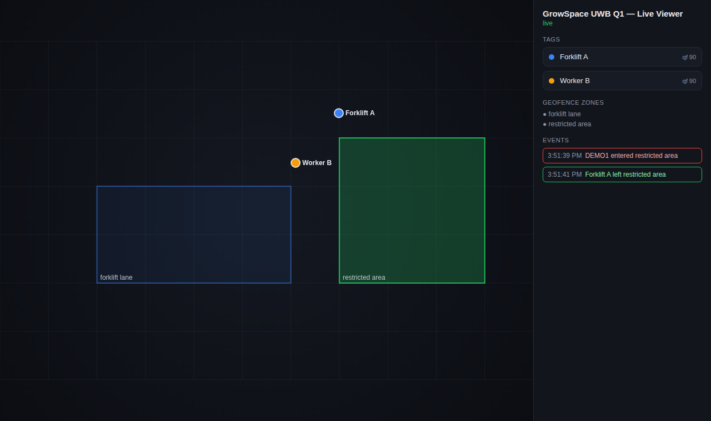

# GrowSpace UWB Q1 — Example Code

Sample code for the **GrowSpace UWB Creator Kit Q1**, a UWB indoor positioning development kit (10–30 cm accuracy, serial and MQTT output).

- Kit and pricing: https://grow-space.io/en/uwb-kit-en-2/
- Full documentation: https://grow-space.io/en/docs/q1-en/
- 한국어: [README.ko.md](README.ko.md)

## What the devices output

Send `lep` over serial (115200 bps) and positions stream as text:

| Source | Format | Example |
|---|---|---|
| Developer tag | `POS,x,y,z,qf` | `POS,-3.41,9.54,-1.53,74` |
| Listener | `POS,idx,tagId,x,y,z,qf` | `POS,0,365D,-3.41,9.54,-1.53,74` |
| Gateway (MQTT) | JSON with a `tags` array under `uwb/gateway/...` | `{"gatewayID":"GR21BA","tags":[{"id":"GR2c3c","x":-3.95,"y":0.23,"z":-2.48}]}` |

Coordinates are meters. `qf` is a 0–100 quality factor; values of 60 and above are usually stable.
Command reference: https://grow-space.io/en/docs/q1-en/commands-en/ · MQTT format: https://grow-space.io/en/docs/q1-en/mqtt-data-format-en/

## Examples

| Folder / file | What it does |
|---|---|
| `python/serial_reader.py` | Read and print live coordinates from a tag or listener, with QF filtering |
| `python/heading_two_tags.py` | Robot heading from two tags (front + rear), averaged |
| `python/geofence.py` | Point-in-polygon zone alerts with enter/exit hysteresis |
| `python/mqtt_subscriber.py` | Subscribe to gateway tag positions over MQTT |
| `python/q1_parse.py` | Shared parsers for serial lines and gateway JSON |
| `arduino/uno_altsoftserial` | Arduino Uno via AltSoftSerial (D8/D9) |
| `arduino/mega_serial1` | Arduino Mega 2560 via hardware Serial1 |

```bash
cd python
pip install -r requirements.txt
python serial_reader.py --port /dev/ttyUSB0
python -m pytest        # parser tests, no hardware needed
```

## Live viewer (web UI)

`python/visualizer/` is a small live dashboard: tags moving on a 2D floor plan, a
custom label per tag ID, and a geofence zone that flashes red/green when a tag
enters or leaves it.



```bash
cd python/visualizer
pip install -r requirements.txt
python server.py --source demo                     # try it with no hardware
python server.py --source serial --port /dev/ttyUSB0
python server.py --source mqtt --host 192.168.0.10
```

Then open http://localhost:8000. Click a tag's name in the sidebar to rename it (saved
in your browser). Zones are defined in `zones.example.json` — point `--zones` at your
own file to match your floor plan.

## Wiring notes

The developer tag has two connectors: **5 V (right)** for Arduino, **3.3 V (left)** for Raspberry Pi and ESP32. Connecting the 5 V side to a Raspberry Pi GPIO can damage its UART. Always cross TX↔RX.

## Guides

- **[Raspberry Pi quickstart](docs/quickstart-raspberry-pi.md)** — wiring, UART setup, and reading positions in ~10 minutes
- **[Troubleshooting guide](docs/troubleshooting.md)** — no serial data, garbled output, low `qf`, Pi/ESP32/Arduino/MQTT issues
- Raspberry Pi (full): https://grow-space.io/en/docs/q1-en/raspberry-pi-en/
- ESP32: https://grow-space.io/en/docs/q1-en/esp32-en/
- Arduino Uno / Mega: https://grow-space.io/en/docs/q1-en/arduino-uno-en/ · https://grow-space.io/en/docs/q1-en/arduino-mega-2560-en/
- Project ideas (robot heading, drones, follow-me, geofence): https://grow-space.io/en/blog/uwb-q1-project-ideas-en/

## Support

Questions or a quote for your floor plan: https://grow-space.io/en/uwb-kit-en-2/#inquiry

Released under the MIT License.
